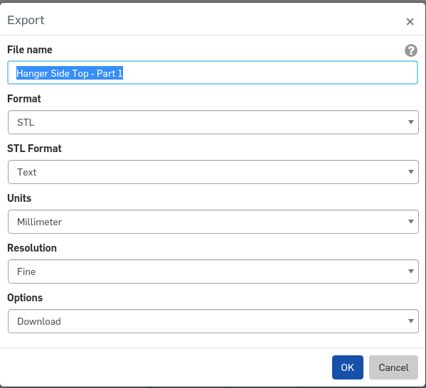

= 3D Printed Parts

3D prints:

All prints are version controlled in onshape.
To generate STL files for Cura, onshape export to STL files using the following settings.  Note the Millimeter Units:

Slice STL files with cura and print on lulzbot (lulzbot specific version of cura: https://www.lulzbot.com/cura)

== Part prints:
|===
|Part|Quantity|Picture|Notes

|Arms
|
|
|

|Motor Mount
|4
a|image::resources/3DPrintedParts/MotorMount.png[]
|Just the mount portion needs to be printed, not the bottom surround.

|ESC Mount
|4
a|image::resources/3DPrintedParts/ESCMount.png[]
|

|Body
|
|
|

|Arm / Leg lock
|6
a|image::resources/3DPrintedParts/ArmLegLock.png[]
|

|Battery Tray
|
|
|

|Hanger side mount
|4
a|image::resources/3DPrintedParts/BatteryHangerSideMount.png[]
|Mirror 2 in Cura

|Hanger side bottom Left
|1
a|image::resources/3DPrintedParts/BatteryHangerSideBottomLeft.png[]
|

|Hanger side bottom Right
|1
a|image::resources/3DPrintedParts/BatteryHangerSideBottomRight.png[]
|

|Axil
|4
a|image::resources/3DPrintedParts/BatteryAxil.png[]
|

|Hanger brace and bracket
|2
a|image::resources/3DPrintedParts/BatteryHangerBraceAndBracket.png[]
|

|Crossbeam
|2
a|image::resources/3DPrintedParts/BatteryCrossbeam.png[]
|

|Flight Controller Mount
|
a|image::resources/3DPrintedParts/FlightControllerMount.png[]
|

|Flight controller Bottom mount
|1
a|image::resources/3DPrintedParts/FlightControllerMountBottom.png[]
|

|GPS Mount
|
|
|

|Bottom
|1
a|image::resources/3DPrintedParts/GPSMountArmBottom.png[]
|

|Screw-down
|1
a|image::resources/3DPrintedParts/GPSMountScrewdown.png[]
|

|Arm bottom
|1
a|image::resources/3DPrintedParts/GPSMountBottom.png[]
|Arm bottom should be cut down to allow for GPS cable to each and be able to be folded

|Arm top
|1
a|image::resources/3DPrintedParts/GPSMountArmTop.png[]
|

|Mast stiffener
|1
a|image::resources/3DPrintedParts/GPSMountMastStiffener.png[]
|

|Other
|
|
|

|Lidar mount
|1
a|image::resources/3DPrintedParts/LidarMount.png[]
|

|===
