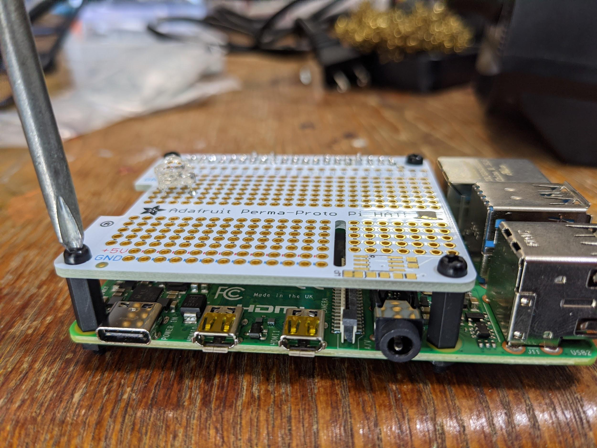
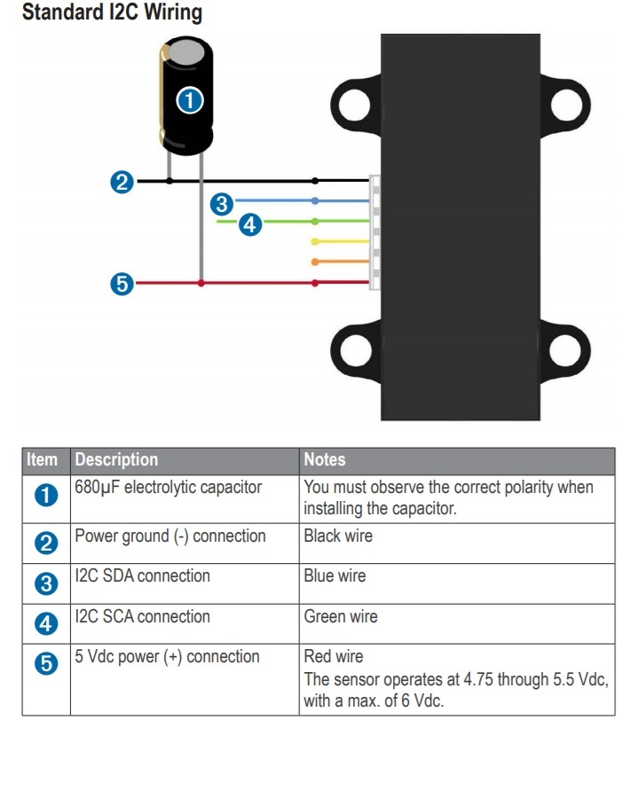

= PhysicalBuild
:toc:

== Tiger Motor Flame 60A ESC programing cable removal mod
Using a 1.5mm hex tool unscrew the 4 bolts

image::resources/PhysicalBuild/ESC/ESCUnScrew.jpg[]

The housing should pull apart smoothly, and then carefully pick off the indicated epoxy.

Use a soldering iron to reflow and remove the indicated wires, then cover the pads with hotglue.

image::resources/PhysicalBuild/ESC/ESCWiresRemoved.jpg[]
While the hotglue is still got place the back cover back on firmly and hold for a few seconds to cool.

Flip back over and reinstall the bolts.

== Arms

Solder motors to ESCs
• 2 motors straight wired, 2 motors with 2 wires swapped.  This supports the motor orientation to hard-wire their rotation.  Make sure to add heat shrink around each solder joint.

image::resources/PhysicalBuild/ESCtoMotor.png[]
Extend power wires from ESCs
• Add heat shrink around each solder joint

image::resources/PhysicalBuild/ESCpower.png[]

Attach Motor to motor mounts
• Make sure to attach metal brackets prior to attaching motors
• Loctite motor bolts and arm bracket bolds

image::resources/PhysicalBuild/motormount1.png[]
image::resources/PhysicalBuild/motormount2.png[]

Cut arm to 18 inches:

`@TODO image of cut arms`

Attach arms to hinges
Hinges need to be removed from the original tarot arms (by force - one ughaduga should do). The hinges are attached to the tarot arms by a bolt and glue.  Start by removing the bolt and then separating the hinge from the arm using a small wedge and a hammer:

image::resources/PhysicalBuild/armHindge1.png[]
image::resources/PhysicalBuild/armHindge2.png[]
image::resources/PhysicalBuild/armHindge3.png[]

Drill a hole to attach the hinge to arm.  This hole should align with the hinge mounting holes -  to align in, you can put the hinge in place and mark a drill point.

image::resources/PhysicalBuild/armDrill.png[]

And attach the hinge to arm using the long bolt

image::resources/PhysicalBuild/armBolt.png[]

Attach mounted motors to end of arms

Hot glue ESCs to ESC mounts and glue to bottom of arm, zip tie to arm

`@TODO image of ziptied arms`

Zip tie all lines into place

Result
4x of these, 2 with swapped ESC / Motor wires:

`@TODO image of finished arms`

== Body

Mount Legs
Unscrew leg brackets and attach them to the body

image::resources/PhysicalBuild/legMount.png[]
image::resources/PhysicalBuild/legMount2.png[]

Reattach legs to brackets and connect set screw

image::resources/PhysicalBuild/legReattach.png[]
image::resources/PhysicalBuild/legReattach2.png[]
Mount Arms
Replace stock tarot frame arm locks with larger 3D printed arm locks.

image::resources/PhysicalBuild/armMount.png[]
Attach built arms to attachment points in the body frame.

image::resources/PhysicalBuild/armBuiltAttach.png[]

`@TODO missing image built arm attach`

Keep in mind motor orientation.  Motors A and C (1 and 2) should be using crossed ESC to motor wiring orientation, motors B and D should be straight. (See Quad motor letter example figure for arm labels).

Solder Hall Effect sensor (Mauch voltage sensor) to XT90 plug
Verify hall effect sensor orientation.  Arrow should be pointing away from the battery in, towards the quad

`@TODO missing image hall effect sensor`

Wire power to main power
Route wires into permanent locations and make sure you have enough slack
Hall Effect

image::resources/PhysicalBuild/wireRoute2.png[]
5 power and 5 ground into 1 power 1 ground -> PL-Sensor -> Anti-spark connectors.  Add heavyduty heat shrink around joints and stow wires

image::resources/PhysicalBuild/wireStow.png[]
Result:

==  Battery Tray
Add Battery Tray
Attach tray hangers to body (metal payload brackets go inside of 3D printed parts):
`@TODO need image`

Add payload rails.  The long bracket end should face towards the back of the quad (weight offsets the payload)

`@TODO need image`

Attach left and right battery brackets using axils and crossbeams to stabilize separation between tray hangers.  Use a battery to ensure that the mounting separation is correct.  The battery should be fixed (not tight or loose) within the battery hangers and brackets.

image::resources/PhysicalBuild/BatteryTrayAttach.png[]
Add glue to axils and crossbeams

image::resources/PhysicalBuild/BatteryTrayGlue.png[]
image::resources/PhysicalBuild/BatteryTrayGlue2.png[]

`@TODO need image of adding glue to axils`

Mount top plate to body
Top plate should face forward with mourning fins on the left and right side of the quad.  The forward orientation of the plate has a notch for GPS mast clearance.

Make sure Mauch has enough slack

`@TODO missing image Mauch slack check`

Widen holes in body to accept bolt

Screw top plate to body with rubber dampeners sandwich between top plate and body

image::resources/PhysicalBuild/screwTopPlate.png[]

Mount pixhawk
Tape Pixhawk down to secondary top plate in corners

image::resources/PhysicalBuild/TapePixhawk.png[]

Glue secondary top plate to top plate with vibration gel

`@TODO need image`

== Assemble Raspberry pi

Solder in mounting leads

Wire indicator LED to hat (LED should have note facing forward)

Solder power jumpers

Attach to Raspperry PI using plastic standoffs

Ziptie down Raspberry pi
Use large ziptie as “belt”, second small ziptie in corner

image::resources/PhysicalBuild/piZiptie.png[]
Ziptie down mauch power supply
Small zip ties in 4 corners

image::resources/PhysicalBuild/mauchPowerZiptie.png[]
Wire mauch to pixhawk power 1 and power 2

image::resources/PhysicalBuild/mauchPixhawkPower.png[]
`@TODO double check this image`

Mount power button and wire to Mauch

image::resources/PhysicalBuild/powerButton.png[]
Wire hall effect sensor (voltage sensor) to Mauch

`@TODO need image`

Run ESC control lines to pixhawk
The motor orientation shoudl already be set, but wiring the control lines tot he pixhawk must be done in the specified order: [A,C,D,B] -> [1,2,3,4]

https://ardupilot.org/copter/docs/connect-escs-and-motors.html#checking-the-motor-numbering-with-the-mission-planner-motor-test

image::resources/PhysicalBuild/motorLayout.png[]

Wire telemetry and radio control to pixhawk, velcro to the bottom

`@TODO need image`

== GPS
`@TODO update images for new GPS MAST`

Assemble GPS stand and mount to front corner of frame
Glue together GPS stand structure.  Verify length will fold down accommodating GPS wire length.

`@TODO need image for GPS wire length`

Attach stand structure to the bottom bracket (add tightener before screwing together):

Mount bottom bracket to the frame.  Keep in mind the orientation of the bolt and angle of the GPS arm.  The arm should tilt in towards the center but face forward and the bolt should face outward for accessibility.  Be sure to add Loctite

Mount GPS device

Wire to Pixhawk GPS, lidar, etc

Wire to raspberry pi pixhawk uart, sba5 usb

Wire in LiDAR

https://docs.px4.io/v1.9.0/en/sensor/lidar_lite.html

https://ardupilot.org/copter/docSebas/common-pixhawk-overview.html#i2c